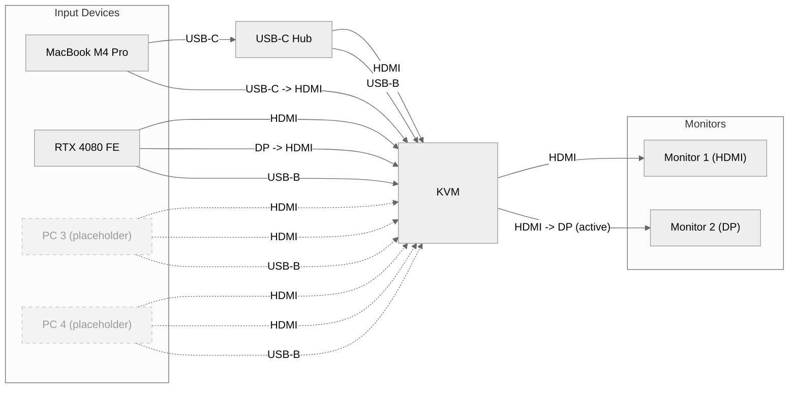

## Introduction

> [!NOTE]
> - When the lockdown happened, I was in the middle of secondary school. I was 14 years old.
> - As a result, I did not get much work done, because I was in year 9.
> - In the UK, year 9 is the last year before GCSEs. This means nothing you learnt will be tested on, so you basically get to do nothing, if you so wish to do so.
> - Because of this, I spent my whole time "working from home" during lockdown playing video games.
> - It was, admittedly, very fun. I did all my work, to be fair, and came out with good grades - but I'd be lying if I didn't say I was playing video games the second it turned 3PM.
> - For what it was I quite enjoyed lockdown, but this note isn't for reflecting on lockdown, it's for detailing my work from home setup.

This is my [[Work from Home setup]] as it stands today. I work and play at the same desk - which maybe isn't great - but saves me money and works well.
It's wired in a very weird way. This is because of:
1. My monitors have weird specs.
2. EDID Emulation only works on HDMI.
3. HDMI 2.1 does not work on one of my monitors.
Because I use it for gaming, I felt it imperative that I was still able to use the 1440p@240hz max spec of my second monitor. HDMI 2.0 only supports up to a max of 144hz, and this wasn't enough for me. So I went out of my way to buy about £80 of cables. Yay!

---
## Diagram
Now do you see how needlessly complicated this looks?
It's actually not that bad. This is pretty much standard minus for a KVM setup, minus about 3 cables.

---
## Parts list
- [ ] x
- [ ] y
- [ ] z

**Un-fun fact:** I have had to return 3 KVMS.
1. They sent the wrong model
2. I saw a better one for sale
3. I bought the wrong model
4. 4 computers, 2 monitors KVM switch - HDMI 2.1, 2k@240hz, EDID emulation.

---
## Showcase
It's great and works well!
TODO (milotek): add video

